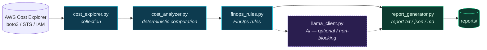

<p align="right"><a href="README.md">Português</a> · <strong>English</strong></p>

# AWS Cost Monitor — FinOps with AI

A Python tool for monitoring and analyzing AWS costs, focused on **FinOps**
practices. It queries account costs through the **AWS Cost Explorer**, groups
spend by service, runs deterministic analysis in Python, and uses an **AI layer
(local Llama)** to interpret the results and produce a final report.

> **Project principle:** *Python computes. AI interprets.*
> Calculation logic is deterministic and lives in Python. The AI layer is kept
> decoupled from the calculation, so the model can be swapped (local model,
> OpenAI, Claude, Gemini, Amazon Bedrock) without touching the analysis logic.
> The AI **never** computes or invents financial values: it receives numbers
> that are already calculated and only interprets them.

---

## About the project

AWS Cost Monitor is a **Cloud / FinOps / Python** portfolio project. The core
idea is to clearly separate two responsibilities:

1. **Deterministic computation** — Python queries AWS, sums, filters, and
   calculates percentages and variations. Always the same result for the same
   input.
2. **Interpretation** — an AI layer that reads the already-calculated numbers
   and produces a natural-language reading, pointing out possible waste or areas
   of attention.

This separation is intentional: it keeps the critical part (the numbers)
auditable and predictable, and treats the AI as a replaceable, optional
component.

---

## Goals

- Query AWS account costs via the AWS Cost Explorer.
- Group costs by service.
- Run deterministic analysis in Python (totals, percentages, period-over-period
  variation).
- Interpret the results with a decoupled AI layer.
- Generate a final report from the analyzed data and the interpretation.

---

## Architecture



> **Python computes** (blue nodes: collection, computation, and FinOps rules).
> **AI interprets** (dashed purple node: optional and non-blocking — if Llama is
> down, the report is still generated).

Flow orchestration lives in `src/main.py`, and parameters (region, day window,
Llama endpoint, report format) are centralized in `src/config.py`.

---

## Application flow

1. `cost_explorer.get_costs()` queries the AWS Cost Explorer and returns a list
   of periods, each with service groups and their costs.
2. `cost_analyzer.analyze_costs()` groups by service, computes the total, filters
   services with positive cost, computes each service's percentage, and
   identifies the highest-cost service. **Returns a structured dictionary.**
3. `cost_analyzer.compare_periods()` compares the two most recent periods and
   computes the percentage variation.
4. `llama_client.interpret()` receives the structured data, builds a prompt with
   the already-calculated values, and asks Llama for a textual interpretation.
   If Llama is unavailable, it raises a clear error that the orchestrator handles.
5. `report_generator.build_report()` assembles the final report (data +
   interpretation) and `save_report()` writes a file into `reports/`.

---

## Current features

- **AWS connection check** (`src/test_aws.py`): uses STS `get_caller_identity`
  to confirm credentials and show `Account` and `ARN`.
- **Cost collection** (`src/aws/cost_explorer.py`):
  - Cost Explorer client in a configurable region (default `us-east-1`).
  - Configurable day window (default 30), `MONTHLY` granularity,
    `UnblendedCost` metric, grouped by `SERVICE`.
  - Explicit handling of missing/incomplete credentials, insufficient permission,
    and Cost Explorer errors (via `CostExplorerError`).
- **Cost analysis** (`src/analysis/cost_analyzer.py`): grouping by service, total
  cost, positive services, percentage per service, largest service, period
  comparison, and safe division-by-zero handling. All functions **return
  structured data**.
- **Deterministic FinOps rules** (`src/analysis/finops_rules.py`): from the
  already-calculated data, it generates alerts for cost growth between periods,
  cost concentration in a single service, and a ranking of the largest services.
  Configurable thresholds. Deterministic — uses neither AI nor network.
- **AI interpretation** (`src/ai/llama_client.py`): sends the calculated data
  (including FinOps alerts) to a local Llama (Ollama-compatible API) and returns
  the interpretation. Handles unavailability via `LlamaUnavailableError`, without
  masking the error and without inventing values.
- **Report** (`src/reports/report_generator.py`): assembles and saves a report
  with period, total, cost and percentage per service, largest service,
  comparison, FinOps alerts, and the AI interpretation. Configurable format:
  **text** (default), **JSON**, or **Markdown**.
- **Orchestration** (`src/main.py`): runs the complete flow with error handling
  at each step.
- **Tests** (`tests/`): `pytest` suite with mocks, with no dependency on the
  real AWS account.

---

## Tech stack

- **Python** `>= 3.14` (see `.python-version` and `pyproject.toml`)
- **[uv](https://docs.astral.sh/uv/)** — environment and dependency management
- **[boto3](https://boto3.amazonaws.com/v1/documentation/api/latest/index.html)** — AWS SDK for Python
- **[requests](https://requests.readthedocs.io/)** — HTTP call to the Llama server
- **[python-dotenv](https://pypi.org/project/python-dotenv/)** — reads config from a `.env` file
- **[pytest](https://docs.pytest.org/)** — tests (dev group)
- **AWS Cost Explorer** / **AWS STS** — cost querying and identity verification
- **Local Llama** (e.g. [Ollama](https://ollama.com/)) — interpretation model

---

## Project structure

```
aws-cost-monitor/
├── src/
│   ├── main.py                 # orchestrates the complete flow
│   ├── config.py               # centralized configuration (.env / env vars)
│   ├── test_aws.py             # AWS connection test (STS)
│   ├── aws/
│   │   └── cost_explorer.py    # cost collection from Cost Explorer
│   ├── analysis/
│   │   ├── cost_analyzer.py    # deterministic cost analysis
│   │   └── finops_rules.py     # deterministic FinOps rules (alerts)
│   ├── ai/
│   │   └── llama_client.py     # AI interpretation layer (Llama)
│   └── reports/
│       └── report_generator.py # report generation/writing (txt/json/md)
├── tests/                      # tests with pytest + mocks
├── data/.gitkeep               # data (content not versioned)
├── reports/.gitkeep            # generated reports (content not versioned)
├── docs/                       # technical documentation
├── main.py                     # shortcut that delegates to src/main.py
├── LICENSE
├── pyproject.toml
├── uv.lock
└── README.md
```

---

## How the cost analysis works

The analysis in `src/analysis/cost_analyzer.py` is fully deterministic.

### `analyze_costs(costs)` → `dict`

Returns `services`, `total_cost`, `positive_services`, `percentages`,
`largest_service`, and `has_positive_cost`.

1. Accumulates the value (`UnblendedCost.Amount`) per service across all periods.
2. Sums the **total cost**.
3. Filters **services with positive cost** (value greater than zero).
4. If the total is positive, computes each service's **share percentage**.
5. Identifies the **highest positive-cost service**.

### `compare_periods(costs)` → `dict | None`

Returns `None` when there are fewer than two periods. Otherwise it returns
`previous_total`, `current_total`, and `variation`.

### Division-by-zero handling

When the previous period has a total cost **equal to zero**, the percentage
variation cannot be computed. The application **does not attempt the division**
and sets the variation to `None`:

```python
if previous_total != 0:
    variation = ((current_total - previous_total) / previous_total) * 100
else:
    variation = None
```

---

## AWS Cost Explorer integration

Collection lives in `src/aws/cost_explorer.py` and uses `boto3`:

- **Client:** `boto3.client("ce", region_name=config.AWS_REGION)` (default `us-east-1`)
- **Period (`TimePeriod`):** from the last `COST_PERIOD_DAYS` days (default 30) up to today.
- **Granularity:** `MONTHLY` · **Metric:** `UnblendedCost` · **Grouping:** `SERVICE` dimension

The function iterates over `ResultsByTime` and organizes each period with
`start`, `end`, `estimated`, and `groups`. Errors are converted into
`CostExplorerError` with clear messages.

---

## AWS configuration

1. **Configure the AWS CLI** with your credentials:

    ```bash
    aws configure
    ```

    boto3 will automatically use the configured credentials.

2. **IAM permissions (least privilege).** The identity only needs:
    - `ce:GetCostAndUsage`
    - `sts:GetCallerIdentity`

    ```json
    {
      "Version": "2012-10-17",
      "Statement": [
        {
          "Effect": "Allow",
          "Action": ["ce:GetCostAndUsage", "sts:GetCallerIdentity"],
          "Resource": "*"
        }
      ]
    }
    ```

> **Never** put an Access Key, Secret Key, or any credential in the repository.

---

## Installation

Prerequisites: [uv](https://docs.astral.sh/uv/getting-started/installation/) and Python 3.14+.

```bash
git clone https://github.com/AirtonNettu/aws-cost-monitor
cd aws-cost-monitor

# Environment + dependencies (includes the dev group with pytest)
uv sync --dev
```

---

## Environment configuration

AWS credentials come from the local AWS CLI configuration. All other parameters
are read from environment variables (optionally from a `.env` file at the root,
loaded via `python-dotenv`). They all have safe defaults — the application runs
without `.env`.

| Variable           | Default                  | Description                                          |
|--------------------|--------------------------|------------------------------------------------------|
| `AWS_REGION`       | `us-east-1`              | Cost Explorer client region                          |
| `COST_PERIOD_DAYS` | `30`                     | Analysis window in days                              |
| `COST_GRANULARITY` | `MONTHLY`                | Query granularity                                    |
| `COST_METRIC`      | `UnblendedCost`          | Cost metric                                          |
| `AI_ENABLED`       | `true`                   | Enables/disables the AI layer                        |
| `LLAMA_BASE_URL`   | `http://localhost:11434` | Llama server endpoint (Ollama-compatible)            |
| `LLAMA_MODEL`      | `llama3`                 | Model name                                           |
| `LLAMA_TIMEOUT`    | `60`                     | Llama call timeout (seconds)                         |
| `FINOPS_GROWTH_THRESHOLD` | `20.0`            | Total-cost growth (%) that triggers an alert         |
| `FINOPS_CONCENTRATION_THRESHOLD` | `50.0`     | Service share (%) that triggers an alert             |
| `FINOPS_TOP_N`     | `5`                      | Number of services in the "top N" ranking            |
| `REPORT_FORMAT`    | `txt`                    | Report format: `txt`, `json`, or `markdown`          |
| `REPORTS_DIR`      | `reports`                | Folder where reports are saved                       |

Example `.env` (not versioned):
```env
AWS_REGION=us-east-1
COST_PERIOD_DAYS=30
AI_ENABLED=true
LLAMA_BASE_URL=http://localhost:11434
LLAMA_MODEL=llama3
FINOPS_GROWTH_THRESHOLD=20
FINOPS_CONCENTRATION_THRESHOLD=50
FINOPS_TOP_N=5
REPORT_FORMAT=txt
```

> The AI layer is optional. With `AI_ENABLED=false`, or with Llama down, the
> report is generated normally, just without the interpretation (the reason is
> recorded in the report).

---

## Running

**Complete flow** (collection → analysis → AI → report):
```bash
uv run python -m src.main
# or, via the root shortcut:
uv run python main.py
```

**Check the AWS connection:**
```bash
uv run python src/test_aws.py
```

**Run only the collection or only the analysis** (useful for debugging):
```bash
uv run python -m src.aws.cost_explorer
uv run python -m src.analysis.cost_analyzer
```

**Choose the report format** (via environment variable):
```bash
# JSON
REPORT_FORMAT=json uv run python -m src.main
# Markdown
REPORT_FORMAT=markdown uv run python -m src.main
```
> On PowerShell (Windows): `$env:REPORT_FORMAT="json"; uv run python -m src.main`

---

## Sample output

> Values are **illustrative**. Real output depends on your AWS account.

Connection check (`test_aws.py`):
```
AWS connected successfully
Account: 123456789012
ARN: arn:aws:iam::123456789012:user/example
```

Final report (`src/main.py`):
```
============================================================
AWS COST MONITOR — COST REPORT
============================================================
Generated at: 2026-10-01 14:30:00
Period analyzed: 2026-09-01 to 2026-10-01

Total cost: 50.00 USD

Cost per service:
  - Amazon EC2: 30.00 USD (60.0%)
  - Amazon S3: 10.00 USD (20.0%)
  - AWS Lambda: 10.00 USD (20.0%)

Largest service: Amazon EC2
...
```

The same content can be produced as **JSON** (`REPORT_FORMAT=json`) or
**Markdown** (`REPORT_FORMAT=markdown`).

---

## Security

- **Never** store AWS credentials in Git.
- Provide credentials via the **AWS CLI** / environment variables.
- Apply **least-privilege IAM**.
- **Do not version** the `.env` file or potentially sensitive data/reports.

---

## Testing

Tests use `pytest` and **mocks**, without touching the real AWS account or Llama.
They cover the critical logic: total cost, grouping (including accumulation
across periods), percentages, largest service, period comparison, previous
period of zero (division by zero), empty data, negative values/adjustments,
FinOps rules (growth, concentration, top N), the AI client (connection/timeout/
empty response), and report generation in text, JSON, and Markdown formats.

```bash
uv run pytest -v
```

---

## Roadmap

### Already implemented (V1)

- [x] Python environment with `uv`.
- [x] AWS connection check via STS.
- [x] Cost collection in Cost Explorer with configurable parameters.
- [x] Deterministic analysis returning structured data (total, positives, %, largest service).
- [x] Period comparison with division-by-zero handling.
- [x] Decoupled AI layer (Llama) with unavailability handling.
- [x] Report generation and saving.
- [x] Full-flow orchestration in `src/main.py`.
- [x] Centralized configuration in `src/config.py` (via `.env`).
- [x] Error handling in every step.
- [x] Test suite with mocks.
- [x] Deterministic FinOps rules (growth, concentration, top N) with configurable thresholds.
- [x] Report in multiple formats: text, JSON, and Markdown.

### In progress / planned

- [ ] Richer granularity and time windows (e.g. `DAILY`, last N months).
- [ ] CLI with arguments (`--days`, `--format`, `--no-ai`).
- [ ] Alerting system (notifications from the FinOps rules).
- [ ] Support for other AI providers (OpenAI, Claude, Gemini, Bedrock).
- [ ] Evolution to serverless architecture (Lambda, EventBridge, SNS, CloudWatch).
- [ ] Automated / scheduled execution.

---

## Technical documentation

A deeper study-oriented write-up lives in [`docs/`](docs/README.md), including
the [Study Guide](docs/study-guide.en.md) covering the FinOps and software-design
concepts behind the code.

---

## License

This project is licensed under the MIT License — see the [LICENSE](LICENSE) file.

---

## Author

**José Airton de Carvalho Neto**

Cloud / FinOps / Python portfolio project.

- GitHub: [@AirtonNettu](https://github.com/AirtonNettu)
- LinkedIn: [jose-airton-cloud](https://www.linkedin.com/in/jose-airton-cloud/)
