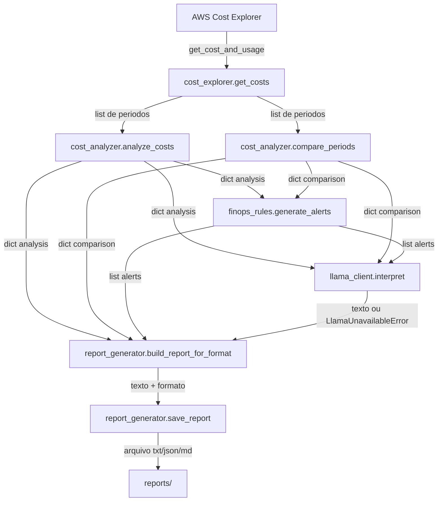

# Fluxo de dados — AWS Cost Monitor V1

> Derivado do código real (`src/main.py` e módulos chamados por ele).

## Visão geral

```text
AWS Cost Explorer
       ↓            get_cost_and_usage (boto3)
cost_explorer.py    get_costs() -> list[dict]
       ↓
cost_analyzer.py    analyze_costs() -> dict
                    compare_periods() -> dict | None
       ↓
finops_rules.py     generate_alerts() -> list[dict]
       ↓
llama_client.py     interpret() -> str        (apenas se AI_ENABLED e disponível)
       ↓
report_generator.py build_report_for_format() -> (str, fmt)
                    save_report() -> caminho
       ↓
reports/report_<timestamp>.(txt|json|md)
```

## Diagrama de fluxo



## Dados que entram

A resposta do Cost Explorer é normalizada por `get_costs` em uma lista de períodos. Cada período:

```python
{
    "start": "2026-09-01",      # TimePeriod.Start
    "end": "2026-10-01",        # TimePeriod.End
    "estimated": False,          # Estimated (default False)
    "groups": [ ... ],           # Groups (lista por serviço)
}
```

Cada grupo segue o formato da AWS (visível também nas fixtures de teste):

```python
{
    "Keys": ["Amazon EC2"],
    "Metrics": {"UnblendedCost": {"Amount": "30.0", "Unit": "USD"}},
}
```

## Como os dados são transformados / calculados

`analyze_costs(costs)`:
- Acumula `float(Metrics.UnblendedCost.Amount)` por `Keys[0]` em `services`.
- `total_cost = sum(services.values())`.
- `positive_services`: itens com valor `> 0`.
- `percentages`: `(amount / total_cost) * 100`, apenas se `total_cost > 0`.
- `largest_service`: `max(positive_services, key=...)` ou `None`.
- `has_positive_cost`: `bool(positive_services)`.

`compare_periods(costs)`:
- `None` se `len(costs) < 2`.
- `previous_total` e `current_total` via `_sum_period` dos dois últimos períodos.
- `variation = ((current - previous) / previous) * 100`, ou `None` se `previous_total == 0`.

## Alertas de FinOps

`generate_alerts(analysis, comparison)` deriva alertas determinísticos dos dicts calculados:
- `growth`: se `comparison["variation"]` existe e supera `FINOPS_GROWTH_THRESHOLD`.
- `concentration`: se o serviço de maior percentual supera `FINOPS_CONCENTRATION_THRESHOLD`.
- `top_services`: ranking dos `FINOPS_TOP_N` maiores serviços positivos.

Cada alerta é `{"type", "severity", "message"}`. A lista (possivelmente vazia) segue para a IA e para o relatório.

## Dados enviados para a IA

`_build_prompt(analysis, comparison, alerts)` monta um texto contendo apenas valores já calculados e formatados: custo total, lista de serviços positivos (valor e %) ordenada desc, maior serviço, e — quando `comparison` existe — totais anterior/atual e variação (ou aviso de variação indisponível). Quando há `alerts`, eles também são listados. O prompt começa com a instrução de não inventar valores.

Payload HTTP enviado por `interpret`:

```python
{"model": config.LLAMA_MODEL, "prompt": <texto>, "stream": False}
```

para `POST {LLAMA_BASE_URL}/api/generate`.

## Dados que retornam da IA

A resposta é lida como JSON e o campo `response` é extraído (`data.get("response")`). Retorno útil: a string, com `.strip()`. Se o campo estiver vazio ou o JSON for inválido, levanta `LlamaUnavailableError` (nada é inventado).

## Como o relatório é produzido

`build_report_for_format(config.REPORT_FORMAT, costs, analysis, comparison, ai_interpretation, ai_error, alerts)` seleciona o builder (texto/JSON/Markdown) e retorna `(texto, formato)`. `save_report(texto, report_format=formato)` grava em `reports/report_<timestamp>.<ext>`. Em `src/main.py`, o relatório também é impresso no stdout antes de ser salvo.

## Rastreabilidade (resumo)

| Dado no relatório | Função | Arquivo |
|---|---|---|
| Período analisado | `_format_period` | `report_generator.py` |
| Custo total | `analyze_costs` → `_money` | `cost_analyzer.py` / `report_generator.py` |
| Custo e % por serviço | `analyze_costs` | `cost_analyzer.py` |
| Maior serviço | `analyze_costs` | `cost_analyzer.py` |
| Comparação / variação | `compare_periods` | `cost_analyzer.py` |
| Alertas de FinOps | `generate_alerts` | `finops_rules.py` |
| Interpretação da IA | `interpret` | `llama_client.py` |
| Formato do relatório | `build_report_for_format` | `report_generator.py` |
