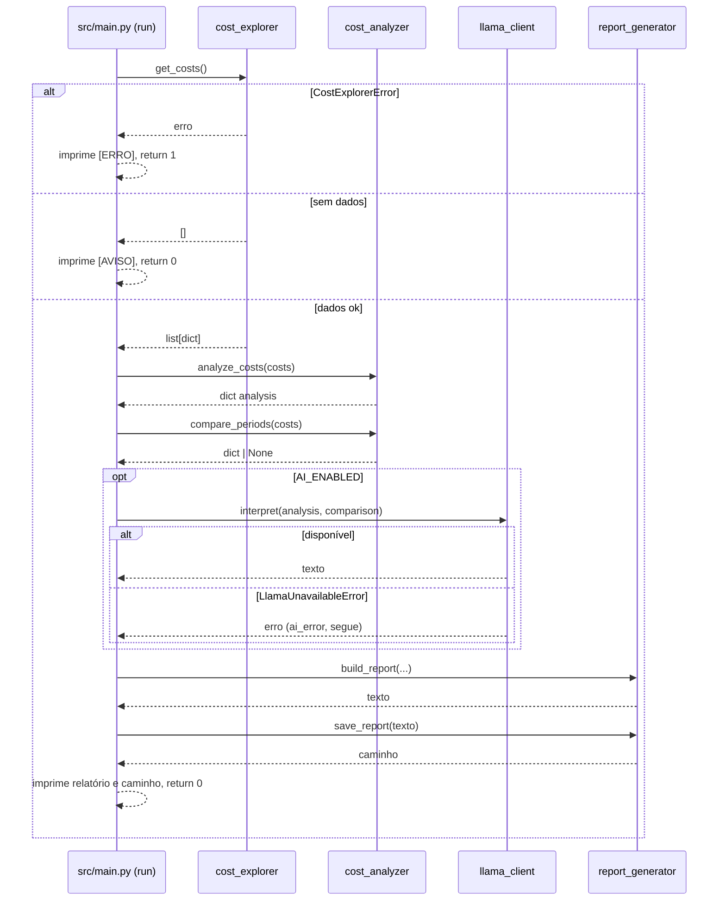

# Desenvolvimento — AWS Cost Monitor V1

> Comandos reais, derivados de `pyproject.toml` e dos módulos do projeto.

## Preparar o ambiente

```bash
uv sync --dev
```

Cria `.venv/` e instala runtime (`boto3`, `python-dotenv`, `requests`) e dev (`pytest`).

## Estrutura em uma frase

`config` fornece parâmetros → `cost_explorer` coleta → `cost_analyzer` calcula → `llama_client` interpreta (opcional) → `report_generator` monta/salva → `main` orquestra. Detalhes em [code-structure.md](code-structure.md).

## Executar

Fluxo completo (coleta → análise → comparação → IA → relatório):

```bash
uv run python -m src.main
# ou o atalho da raiz:
uv run python main.py
```

Módulos isolados (úteis para depuração, cada um tem bloco `__main__`):

```bash
uv run python -m src.aws.cost_explorer      # imprime os períodos coletados ou "Erro: ..."
uv run python -m src.analysis.cost_analyzer # imprime os dicts de análise e comparação
```

Verificação de credenciais (script manual):

```bash
uv run python src/test_aws.py
```

## Testes

```bash
uv run pytest -v
```

Estado atual: 20 passed. Não exigem AWS nem Llama (usam fixtures e `monkeypatch`). Ver [testing.md](testing.md).

## Sequência principal de execução



## Fluxo de desenvolvimento sugerido

1. Faça a alteração no módulo correspondente (uma responsabilidade por módulo).
2. Rode `uv run pytest -v`.
3. Para mudanças que afetam a saída real, rode `uv run python -m src.main` (exige AWS; a IA é opcional).
4. Verifique o relatório gerado em `reports/`.

## Como validar alterações

- **Lógica de cálculo:** cubra com testes em `tests/test_cost_analyzer.py` (fixtures em `conftest.py`).
- **IA:** use `monkeypatch` sobre `llama_client.requests.post` (ver `tests/test_llama_client.py`); não faça chamadas HTTP reais nos testes.
- **Relatório:** chame `build_report` com dados fictícios (ver `tests/test_report_generator.py`).

## Convenções observadas no código

- Imports absolutos `from src...` (habilitados por `pythonpath = ["."]`).
- Docstrings em português; funções auxiliares privadas com prefixo `_` (`_sum_period`, `_build_prompt`, `_money`, `_format_period`, `_get_int`).
- Exceções de domínio por camada: `CostExplorerError`, `LlamaUnavailableError`.
